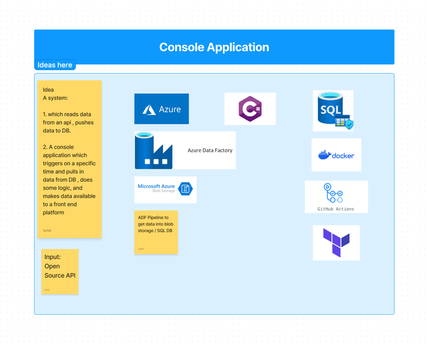

# my-console-application
This is a simple C# console application. The application is aimed to use:

* .NET 6 Console Application
* Rest Sharp Library https://restsharp.dev
* Serilog Logging Library https://serilog.net
* Github Actions https://github.com/features/actions
* Maybe some testing as well (SpecFlow) https://specflow.org

